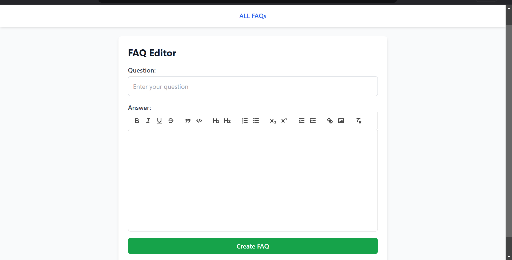
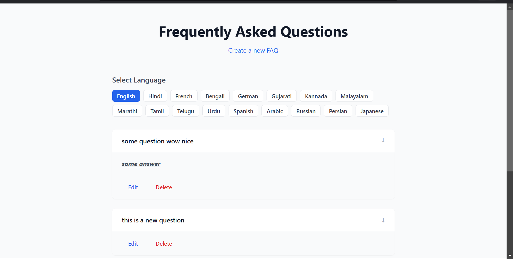
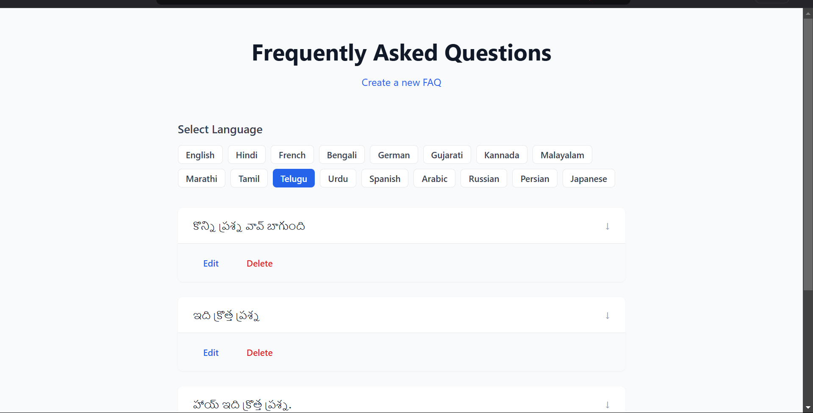

# Multilingual FAQ API

## Objective

The objective of this project is to create a multilingual FAQ management system using Node.js and Express. The system allows users to manage FAQs with support for multiple languages and provides a basic UI for managing FAQs.

## Features

- Support for WYSIWYG editor for formatting and creating answers.
- REST API for managing FAQs with language selection.
- Caching mechanism for improved performance.
- Multi-language translation support using Google Translate API.
- User-friendly admin interface for managing FAQs.
- Unit tests and code quality checks.
- Detailed documentation and proper Git commit messages.

## Installation

1. Clone the repository:

   ```bash
   git clone https://github.com/rishuraj1/multilingual-faq-api.git
   cd multilingual-faq-api
   ```

2. Install dependencies:

   ```bash
   npm install
   ```

3. Set up environment variables:
   Create a `.env` file in the root directory and add the following variables:

   ```env
   PORT=8000
   REDIS_HOST=your_redis_host
   REDIS_PORT=your_redis_port
   MONGO_URI=your_mongodb_connection_string
   ```

4. Start the server:
   ```bash
   npm start
   ```

## API Usage

### Fetch FAQs in English (default)

```bash
curl http://localhost:8000/api/faqs/
```

### Fetch FAQs in Hindi

```bash
curl http://localhost:8000/api/faqs/?lang=hi
```

### Fetch FAQs in Bengali

```bash
curl http://localhost:8000/api/faqs/?lang=bn
```

## Screenshots

- 

- 

- 